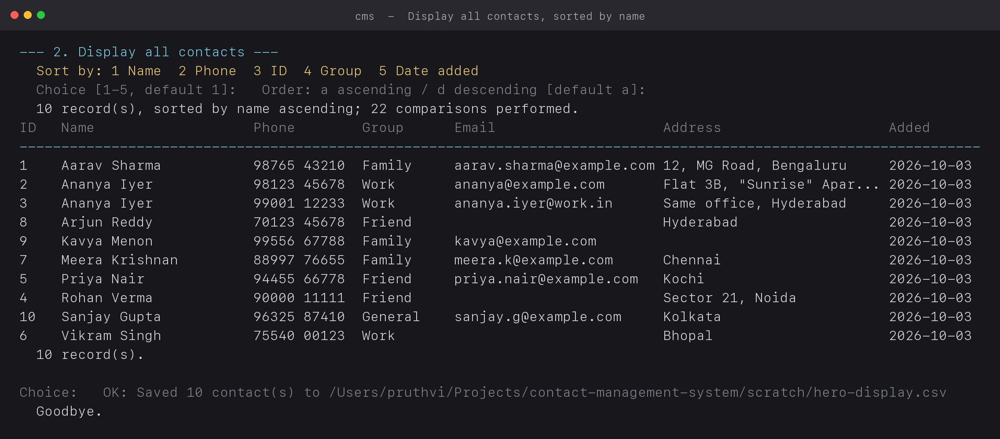
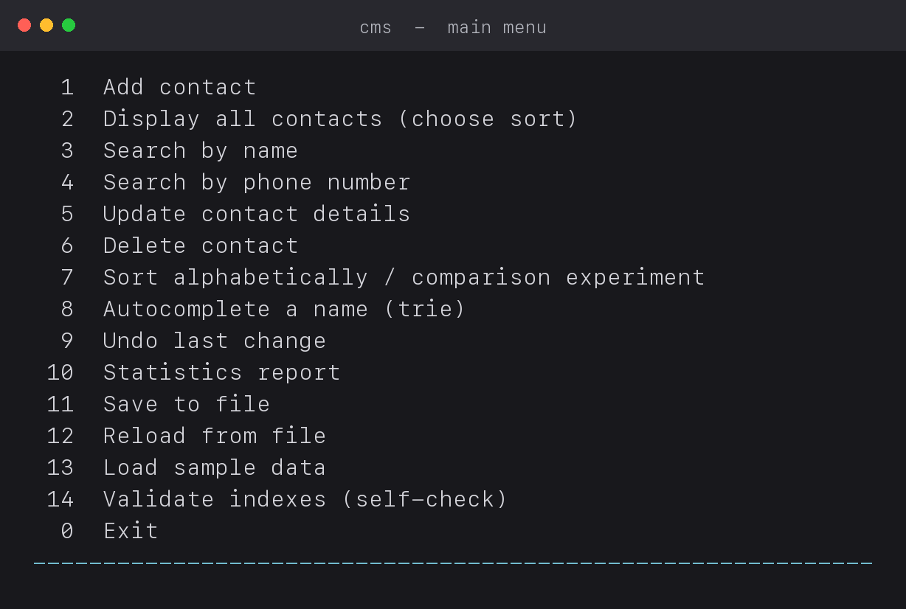
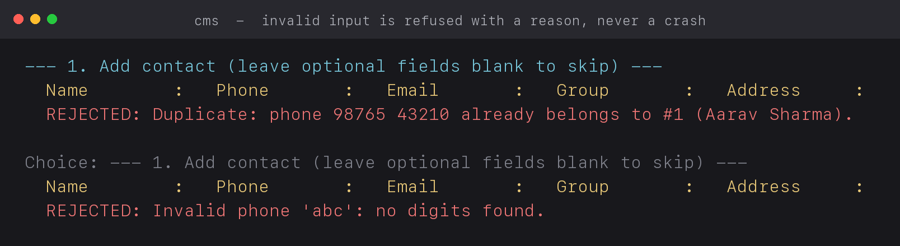
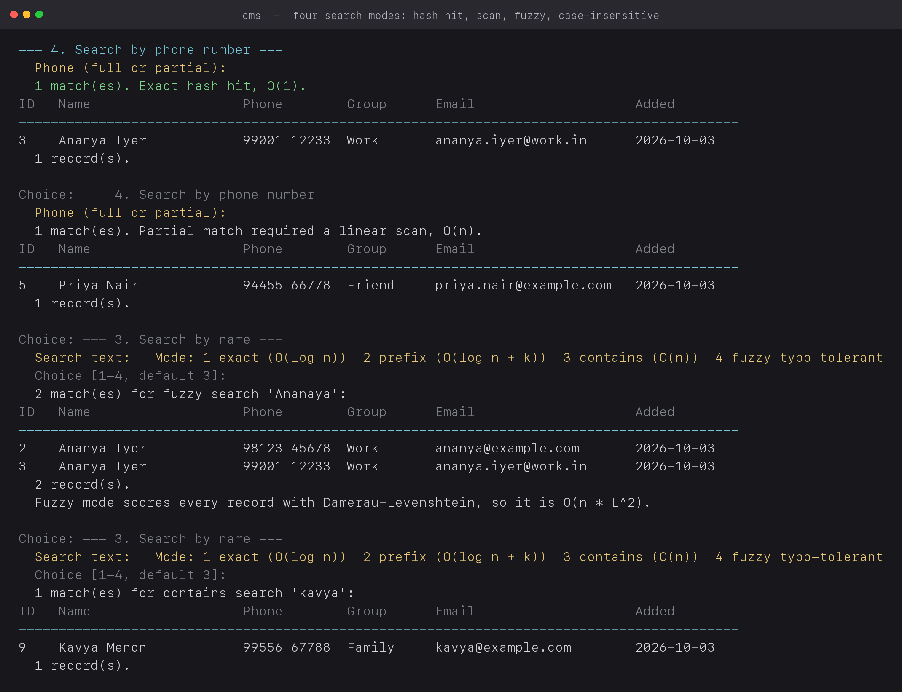
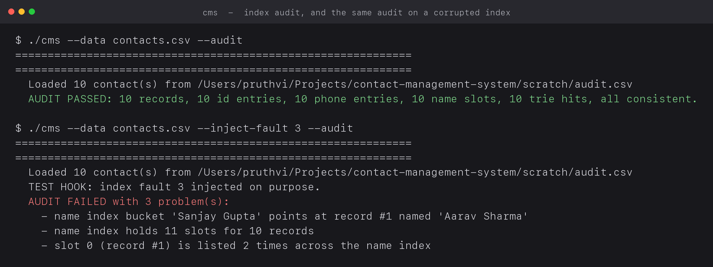
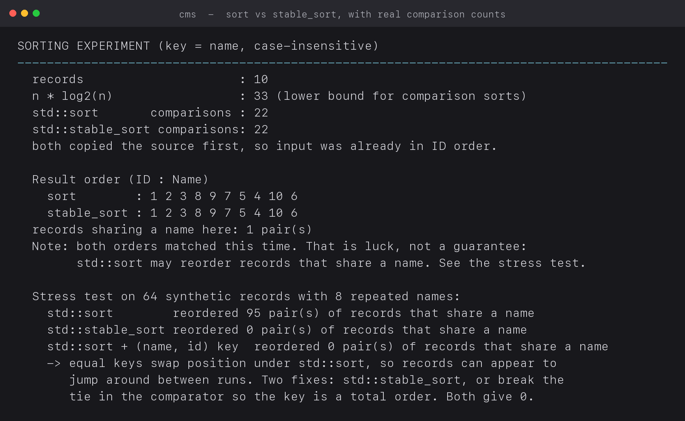
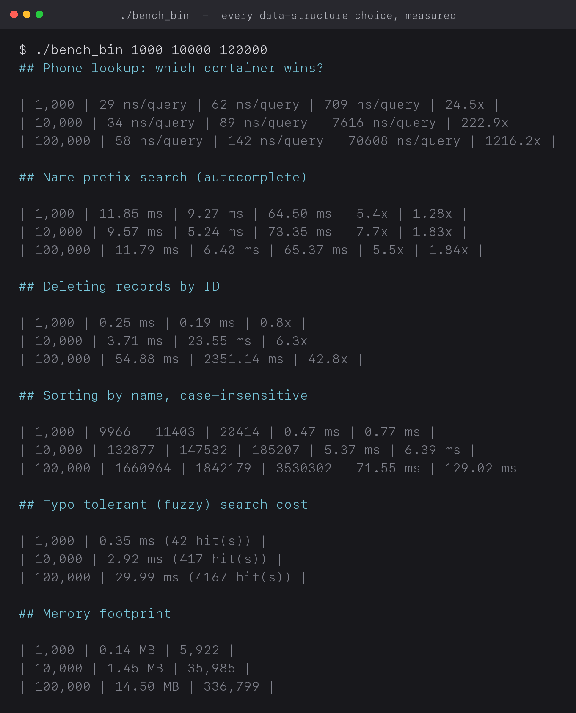

<div align="center">

```
   ██████╗ ██████╗ ███╗   ██╗████████╗ █████╗  ██████╗████████╗
  ██╔════╝██╔═══██╗████╗  ██║╚══██╔══╝██╔══██╗██╔════╝╚══██╔══╝
  ██║     ██║   ██║██╔██╗ ██║   ██║   ███████║██║        ██║
  ██║     ██║   ██║██║╚██╗██║   ██║   ██╔══██║██║        ██║
  ╚██████╗╚██████╔╝██║ ╚████║   ██║   ██║  ██║╚██████╗   ██║
   ╚═════╝ ╚═════╝ ╚═╝  ╚═══╝   ╚═╝   ╚═╝  ╚═╝ ╚═════╝   ╚═╝
     one record · four indexes · every cost measured
```

**A menu-driven C++17 contact manager that can prove its own design.**

It stores contacts, searches them four different ways, and prints the measured cost of every
data-structure choice it made — so the claim "we picked this structure for a reason" comes with
a number attached.

[](https://github.com/prutxvi/contact-management-system/actions/workflows/ci.yml)
[](LICENSE)
[](#-quickstart)
[](#-testing)
[](#-quickstart)
[](#-quickstart)

[Quickstart](#-quickstart) · [Why four indexes](#-why-four-indexes) · [Measured results](#-measured-results) · [Screenshots](#-screenshots) · [Testing](#-testing) · [Term-project docs](#-term-project-docs)

</div>

---

## 📖 Table of contents

- [What it is](#-what-it-is)
- [Screenshots](#-screenshots)
- [Quickstart](#-quickstart)
- [The menu](#-the-menu)
- [Why four indexes](#-why-four-indexes)
- [Measured results](#-measured-results)
- [Counter-results we report against ourselves](#-counter-results-we-report-against-ourselves)
- [Testing](#-testing)
- [Requirement traceability](#-requirement-traceability)
- [Edge cases](#-edge-cases)
- [Project structure](#-project-structure)
- [Term-project docs](#-term-project-docs)
- [Roadmap](#-roadmap)
- [License](#-license)

---

## 🧭 What it is

A single-file C++17 console application, plus the evidence needed to defend it.

Seven mandatory features sit behind a text menu: add, delete, search by name, search by phone
number, update, display, sort alphabetically. The interesting part is not those seven features —
it is that a contact list is queried in **four different ways**, and no single data structure
answers all four efficiently. So the design keeps one array of records and four indexes over it,
and a benchmark that measures each index against its obvious alternatives on the same data.

Three things follow from that:

| | |
|---|---|
| 🎯 **Every choice has a number** | `bench/bench.cpp` times the chosen structure against the alternatives at 1k / 10k / 100k records. `docs/benchmarks.md` is generated from the run. |
| 🛡️ **Correctness is checked, not assumed** | An index audit (menu 14) verifies the central invariant in both directions, and `--inject-fault 1..5` deliberately corrupts an index to prove the audit can actually fail. |
| 🧪 **The tests drive the real binary** | 64 assertions pipe scripts into the compiled program and read its stdout, so tests exercise exactly what the demo shows. |

No third-party libraries. No platform-specific calls. No non-constant globals. Warning-clean
under `-Wall -Wextra -Wpedantic -Werror`.

## 📸 Screenshots

<p align="center">
  
</p>

<p align="center">
  <em>The display feature: sorted by name, with the number of comparisons the sort performed printed underneath.</em>
</p>

| | |
|---|---|
|  |  |
| **The menu** — 15 options, 7 of them the mandatory features | **Invalid input** — refused with a reason, never a crash |
|  |  |
| **Four search modes** — hash hit, partial scan, fuzzy, case-insensitive | **Index audit** — passing on clean data, failing on injected damage |

<p align="center">
  
</p>

<p align="center">
  
</p>

> Every pixel of text in these images is produced by running the real binary —
> `scripts/make_screenshots.py` captures the output and renders it. Regenerate with
> `python3 scripts/make_screenshots.py`.

## 🚀 Quickstart

```bash
git clone https://github.com/prutxvi/contact-management-system.git
cd contact-management-system

make                 # builds ./cms
make run             # runs it against ./contacts.csv
```

Or with no make, one command, no dependencies:

```bash
c++ -std=c++17 -O2 -Wall -Wextra -Wpedantic -o cms src/contact_manager.cpp
./cms --data contacts.csv --seed      # --seed loads 10 sample contacts
```

Then type `2`, `1`, `a` to see the list sorted by name. Type `0` to exit.

### All targets

```bash
make            # build the application
make run        # run it
make test       # build, then run the 64 behaviour tests
make measure    # rebuild docs/benchmarks.md on this machine
make bench      # build the benchmark binary as ./bench_bin
make demo       # replay the 20-step demo into demo/session.log
make package    # write dist/Group11_ContactManagementSystem.zip for submission
make clean
```

### Command-line flags

| Flag | Effect |
|---|---|
| `--data FILE` | CSV file to load at start and save into (default `contacts.csv`) |
| `--seed` | add the ten sample contacts if the list is empty |
| `--audit` | run the index self-check, print the result, exit 0 or 1 — usable in a script |
| `--inject-fault N` | testing hook: corrupt index N (1–5) after loading |
| `--help` | usage |

```bash
./cms --data contacts.csv --seed > /dev/null
./cms --data contacts.csv --audit                 # AUDIT PASSED ... exit 0
./cms --data contacts.csv --inject-fault 3 --audit  # AUDIT FAILED ... exit 1
```

## 🎛 The menu

| # | Option | What it does inside |
|---|---|---|
| 1 | Add contact | validate → normalise the phone → duplicate check → append → link four indexes |
| 2 | Display all | pick a sort key and direction; prints the table and the comparison count |
| 3 | Search by name | four modes: exact `O(log n)`, prefix `O(log n + k)`, contains `O(n)`, fuzzy `O(n·L²)` |
| 4 | Search by phone | `O(1)` hash hit, or a linear scan for a partial key — the message says which ran |
| 5 | Update contact | field by field, blank keeps, `-` clears; the record is excluded from its own duplicate check |
| 6 | Delete contact | confirm → move-the-last-record-into-the-hole delete → repair one index entry |
| 7 | Sort experiment | `std::sort` vs `std::stable_sort` vs a total-order key, with counters and a 64-record stress test |
| 8 | Autocomplete | trie prefix walk, up to 10 suggestions, already alphabetical |
| 9 | Undo | reverses the last of the 20 recorded changes, including a delete |
| 10 | Statistics | structure sizes, group histogram, missing fields, repeated names, near-duplicate names |
| 11 / 12 | Save / Reload | atomic write via temp file + rename; header-driven read that skips and counts bad rows |
| 13 | Sample data | ten seed contacts, including a deliberate duplicate name |
| 14 | Validate indexes | the audit: every index checked against every record, in both directions |

## 🏗 Why four indexes

One array of records, and four ways to find something in it.

```
                 ┌───────────────────────────────────────────────┐
                 │ rows_   std::vector<Contact>                  │
                 │ storage of record — dense, contiguous         │
                 └───────────────────────────────────────────────┘
                    ▲          ▲            ▲              ▲
   position (size_t)│          │            │              │
        ┌───────────┴──┐  ┌────┴─────┐  ┌───┴───────┐  ┌───┴──────────────┐
        │ byId_        │  │ byPhone_ │  │ byName_   │  │ trie_            │
        │ unordered_map│  │ unord_map│  │ std::map  │  │ Trie             │
        │ id → pos     │  │ phone→pos│  │ name →    │  │ prefix → ids     │
        │ O(1) average │  │ O(1) avg │  │ vector    │  │ O(prefix length) │
        │              │  │          │  │ O(log n)  │  │                  │
        └──────────────┘  └──────────┘  └───────────┘  └──────────────────┘
```

| Question asked of the data | Structure | Cost | Why not the alternatives |
|---|---|---|---|
| "Show me all contacts" | `std::vector<Contact>` | scan O(n), append O(1) amortised | a `std::list` scatters records across the heap and gives up contiguous iteration |
| "Give me the record with ID 7" | `std::unordered_map<int, size_t>` | O(1) average | a scan is O(n); a tree costs O(log n) for an ordering nobody needs |
| "Who owns 9876543210? Is it a duplicate?" | `std::unordered_map<std::string, size_t>` | O(1) average | a sorted array costs O(log n), a scan O(n); the duplicate check runs on every add |
| "All names beginning with An" | `std::map<std::string, std::vector<size_t>, CiLess>` | O(log n + k) | **a hash table cannot answer this at all** — hashing destroys order. This is why both a hash map and a tree appear in one program |
| "Suggest a name from the letters Sa" | Trie | O(prefix length + k) | independent of how many keys exist, and the DFS already returns matches alphabetically |
| "Undo my last change" | `std::deque<Action>` | O(1) | LIFO is a stack, but a `std::stack` cannot drop its oldest entry |

Two rules keep the indexes honest, and they are the reason this is not a maintenance nightmare:

1. **`linkIndexes` and `unlinkIndexes` are the only functions that touch an index.** There is no
   second place to forget.
2. **Indexes store positions, never pointers.** The vector reallocates when it grows, and the
   delete strategy moves records; a position survives that, a pointer would not.

### The delete, in one paragraph

`vector::erase` is O(n) because every later element must move. Instead the **last** record is moved
into the hole and the tail is popped. One record moved, so exactly one record needs re-indexing:
unlink it from the old last slot, relink it at the new one. Cost independent of the list length.
Measured at 100,000 records: **50.72 ms against 2,330.77 ms** for `vector::erase` — **46x**.

Storage order becomes arbitrary afterwards, which is fine: order is a property of the *view*, not
of the array. Every display sorts, and IDs are monotonic, so insertion order is always recoverable.

### Why the phone number is a string

`9876543210` does not fit in a 32-bit `int` and silently becomes `2147483647`. A number starting
with `0` would lose its leading zero. Storing it as a string removes both failure modes and allows
digit-level validation. Normalisation runs *before* the duplicate check, so `+91 98765 43210` and
`098765-43210` cannot both be stored as different contacts.

## 📈 Measured results

All figures produced by `bench/bench.cpp` on Apple Silicon / clang 21 / `-O2`. Reproduce with
`make measure`. Absolute times are machine dependent; the shape of the curves is not.

### Exact phone lookup

| n | hash index O(1) | sorted vector + binary search O(log n) | linear scan O(n) | scan / hash |
|---|---:|---:|---:|---:|
| 1,000 | 40 ns | 62 ns | 715 ns | 18x |
| 10,000 | 37 ns | 86 ns | 7,305 ns | 197x |
| 100,000 | 94 ns | 139 ns | 69,974 ns | **748x** |

The hash index is flat as n grows — that is the O(1) claim, measured. The sorted vector loses at
every size, but only by 1.6–2.5x rather than the factor the O(log n) bound suggests, because each
binary-search step touches contiguous memory.

### Deleting records

| n | swap-with-last + index repair | `vector::erase` | speed-up |
|---|---:|---:|---:|
| 1,000 | 0.23 ms | 0.19 ms | 0.8x |
| 10,000 | 3.72 ms | 23.41 ms | 6.3x |
| 100,000 | 50.72 ms | 2,330.77 ms | **46x** |

### Sorting

| n | n·log₂n bound | `std::sort` comparisons | `std::stable_sort` comparisons | `std::sort` | `std::stable_sort` |
|---|---:|---:|---:|---:|---:|
| 1,000 | 9,966 | 11,403 | 20,414 | 0.46 ms | 0.77 ms |
| 10,000 | 132,877 | 147,532 | 185,207 | 6.25 ms | 7.34 ms |
| 100,000 | 1,660,964 | 1,842,179 | 3,530,302 | 75.38 ms | 130.74 ms |

Stability stress test — 64 synthetic records containing 8 repeated names:

| Sort | Pairs of same-name records reordered |
|---|---:|
| `std::sort` | **95** |
| `std::stable_sort` | **0** |
| `std::sort` with the key `(name, id)` | **0** |

### Typo-tolerant search

| n | time for one query |
|---|---:|
| 1,000 | 0.32 ms |
| 10,000 | 3.13 ms |
| 100,000 | 30.58 ms |

Linear in n, as expected for a path that scores every record. Deliberately the slow one.

## 🔍 Counter-results we report against ourselves

Two measurements contradicted the naive expectation. Both are printed by the program.

1. **The trie is ~2x slower than the ordered map's `lower_bound`** at 1k–100k in-memory records,
   even though it beats a linear scan by 4.9–7.1x. Both structures chase pointers; the trie pays
   more per node. It is asymptotically the right structure for prefix completion and wins for long
   keys and incremental suggestion — but at this scale the map is competitive.

   | n | trie | ordered map `lower_bound` | linear scan | scan / trie | trie / map |
   |---|---:|---:|---:|---:|---:|
   | 1,000 | 11.68 ms | 8.47 ms | 60.23 ms | 5.2x | 1.38x |
   | 10,000 | 8.65 ms | 4.70 ms | 61.19 ms | 7.1x | 1.84x |
   | 100,000 | 12.65 ms | 6.11 ms | 62.58 ms | 4.9x | 2.07x |

2. **The O(1) delete loses at n = 1,000.** Index repair is a fixed cost per delete; the memmove it
   avoids is tiny at that size. The advantage only appears as n grows.

A claim that survives measurement is worth more than one that is never tested.

## 🧪 Testing

```bash
make test        # or: python3 tests/test_cms.py
```

64 assertions across 14 test functions, driving the compiled binary through stdin.

| Test | Property verified |
|---|---|
| `test_delete_keeps_indexes_consistent` | after deleting a middle record, every survivor is still reachable by ID, name and phone |
| `test_index_audit_passes_and_detects_every_fault` | the audit passes clean and reports all five injected faults |
| `test_csv_round_trip_survives_punctuation` | a two-line address with a comma and a quote survives load → save → reload byte for byte |
| `test_validation_rules` | letters-only phone, short phone, zero-leading phone, all-digit name, bad email, duplicate in another notation |
| `test_unwritable_destination_fails_cleanly` | a failed save reports, does not crash, and preserves in-memory data |
| `test_update_protects_duplicate_phone_and_immutable_id` | self-exclusion works; renaming is allowed |
| `test_empty_store_is_safe` | every option behaves correctly on an empty list |
| `test_undo_paths` | delete-undo, add-undo, empty history |
| `test_sorting_is_monotonic` | output really is sorted, and the comparison count is plausible |
| `test_csv_duplicate_and_bad_rows_are_reported` | skips are counted, not silent |
| `test_missing_required_column_is_reported` | a wrong header is refused with the required columns named |
| `test_autocomplete_order_and_prefix_misses` | two hits for `An`, and a clear negative result |
| `test_large_batch_insert_and_lookup` | 200 inserts, statistics correct, exact hash path used, reload intact |
| `test_whitespace_is_squeezed` | `   Pruthvi    Raj   Toganti  ` is stored as `Pruthvi Raj Toganti` |

CI runs on Linux and macOS: builds with `-Werror`, runs the tests, runs the audit, and **fails the
build if the audit passes on a corrupted index**.

## ✅ Requirement traceability

| Brief requirement | Implementation | Demonstrated by |
|---|---|---|
| Add contact | `ContactStore::add`, menu 1 | demo steps 8–9 |
| Delete contact | `ContactStore::remove`, menu 6 | demo step 12, `test_delete_keeps_indexes_consistent` |
| Search by name | `searchByName`, menu 3 | demo steps 3, 6, 7 |
| Search by phone number | `searchByPhone`, menu 4 | demo steps 4, 5 |
| Update contact details | `update`, menu 5 | demo steps 10, 11 |
| Display all contacts | `menuDisplay`, menu 2 | demo step 2 |
| Sort alphabetically | `sorted`, menus 2 and 7 | demo steps 2, 15 |
| Menu-driven | `main`, options 0–14 | `demo/session.log` |
| Separate functions | one handler per option, one method per operation | `src/contact_manager.cpp` |
| Structures | `Contact`, `Action`, `CiLess`, `Trie::Node` | [Why four indexes](#-why-four-indexes) |
| Strings | trim, fold, compare, digit extraction, CSV state machine | `util` namespace, `csv` namespace |
| Arrays / STL containers | `vector`, `unordered_map`, `map`, `deque` | [Why four indexes](#-why-four-indexes) |
| Searching | hash, ordered range, linear scan, edit distance, trie walk | [The menu](#-the-menu) |
| Sorting | `std::stable_sort` with counters and a stability stress test | [Measured results](#-measured-results) |
| Explain the structures | `docs/report.md` Section 4 | this README |

## 🛡 Edge cases

| Case | Behaviour |
|---|---|
| Empty records | every option prints its own message; search says "list is empty", not "no match" |
| Invalid IDs | `No contact with ID 99.` |
| Duplicate entries | unique phone enforced on add **and** update, across formatting variants, naming the owner |
| Unavailable resources | missing file → empty list; unwritable target → error, data preserved; partial write → previous file intact |
| Invalid input | non-numeric, partially numeric and out-of-range menu input rejected; the menu repeats |
| Empty search text | refused, instead of matching everything |
| Repeated name | allowed and reported, because names are not unique |
| Self-update | accepted — the duplicate check excludes the record under edit |
| Undo of a delete whose phone was reused | refused, with the reason stated |
| Input stream ending mid-prompt | saves and exits cleanly |

## 📂 Project structure

```
contact-management-system/
├── src/contact_manager.cpp       the whole application, one file, 11 marked sections
├── bench/bench.cpp               every data-structure choice, measured against its alternatives
├── tests/test_cms.py             64 behaviour tests driving the compiled binary
├── scripts/make_screenshots.py   renders docs/images/ from real program output
├── demo/
│   ├── steps/in.txt              the 20 demonstration keystrokes
│   ├── steps/intent.txt          what each step is for, and which edge case it proves
│   └── session.log               a saved full run, 535 lines
├── docs/
│   ├── explained.md              start here: basics → design → workflows → how to edit safely
│   ├── report.md                 the term-project report (989 lines)
│   ├── viva_qa.md                viva questions with prepared answers
│   ├── idea_book.md              23 further ideas, ranked, with the DSA concept each adds
│   ├── assignment.md             the brief, transcribed and mapped to the implementation
│   ├── benchmarks.md             generated by `make measure`
│   └── images/                   screenshots, generated from real output
└── .github/workflows/ci.yml      build + test + audit on Linux and macOS
```

## 📚 Term-project docs

Built as a college term project, so the paperwork is in the repo too.

| Document | What it is |
|---|---|
| [`docs/explained.md`](docs/explained.md) | From zero: what DSA is, what the brief asks, how the design works, every workflow, and recipe tables for editing safely |
| [`docs/report.md`](docs/report.md) | The full report: abstract, design, data-structure justification, 14 algorithms in pseudocode, testing, measured results, references |
| [`docs/viva_qa.md`](docs/viva_qa.md) | 30+ viva questions with answers, including the traps |
| [`docs/idea_book.md`](docs/idea_book.md) | 23 ranked ideas with effort and the DSA concept each one adds |
| [`docs/assignment.md`](docs/assignment.md) | The brief, transcribed, with a requirement-by-requirement answer |

## 🗺 Roadmap

- [ ] BK-tree for fuzzy search — cut the O(n·L²) scan to a tree walk, and extend the benchmark to prove it
- [ ] Union-Find to cluster and merge probable duplicates (the stats screen already finds them)
- [ ] Group graph + BFS — "how do I know this person?" through shared groups
- [ ] LRU cache for repeated lookups — hash map + doubly linked list, with a measured hit rate
- [ ] On-disk index so loading does not rebuild everything
- [ ] vCard (RFC 6350) import/export alongside CSV
- [ ] `--query` batch mode so operations can be scripted without the menu

## 📄 License

[MIT](LICENSE) © Toganti Pruthvi Raj

---

<div align="center">
<sub>Built for Group 11. The point of the project is not the contact list — it is that every design claim has a number attached to it.</sub>
</div>
